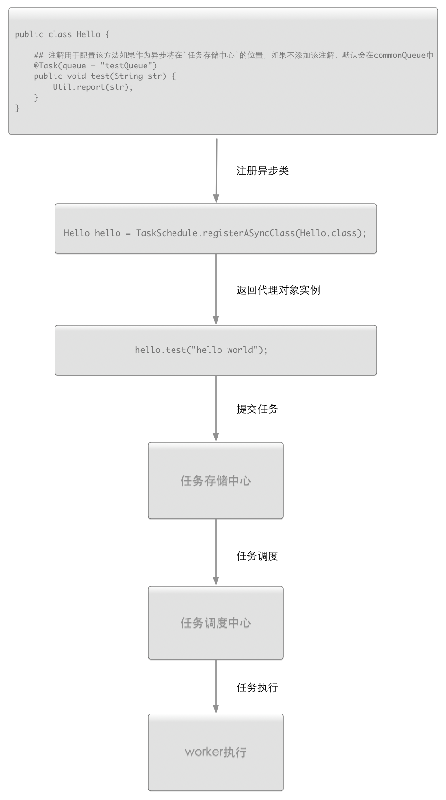
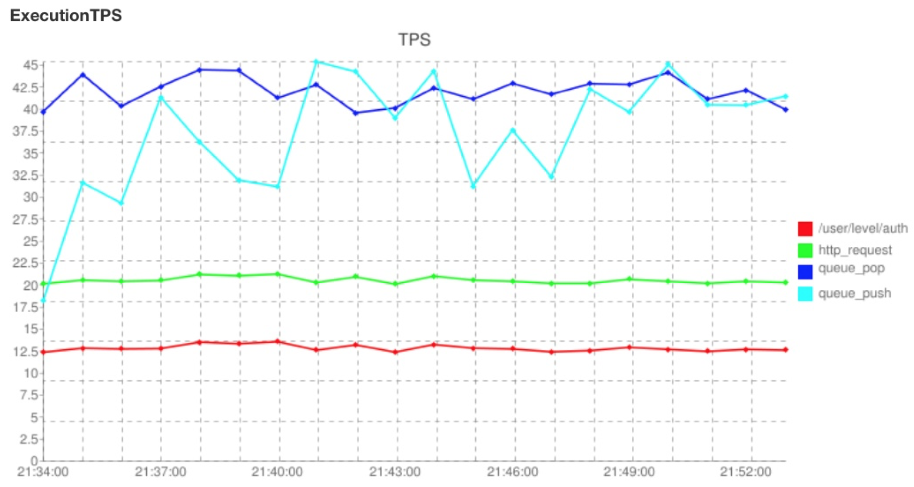

任务容器组件设计与使用
----------------

### 概述

适用于java项目中需要异步处理、并发处理、分布处理、任务调度等业务处理场景。 

先看一个简单的用例，通过注册原生的Java对象到任务容器中，快速让你的方法实现异步并发调用：

	// Java原生对象
	public class Hello {

    	@Task(queue = "testQueue")
    	public void test(String str) {
        	Util.report(str);
    	}
	}
	
	// 注册原生Java对象到任务容器中
	Hello hello = TaskSchedule.registerASyncClass(Hello.class);
	
	// 此处调用test方法已经变成异步并发调用了
	hello.test("hello world");

### 版本

此文档只适合2.0-SNAPSHOT版本

### 你想好了吗

你是否真的需要这样的一个工具，到底是异步还是同步，什么样的才可以称的上任务。在使用前，希望你也可以考虑清楚这些问题。这里我需要声明的是，`能同步的最好不要异步`。异步虽然可以提高系统吞吐量，但它是在高于一定得计算量请求量的情况下才可以显现出来这一特点。当你决定需要它时，你就要决定放弃及时响应的特性，虽然它可以达到近实时的计算(在无压力下，一个任务默认可能会出现延迟1s执行，这个时间可以设置)。另外，你是否需要的是一个分布式的异步并行框架，还是JDK自带的单机并发框架，如果`executorservice`就可以满足了，那你也不必使用它了，虽然我个人觉得这个在使用时会更方面，但我并不想让你那么做，`能满足需求就好`，方案永远不止一个，用你最熟悉的吧。

### 设计模型

【任务存储中心】：各个业务提交的task到任务存储中心，提交成功后将返回一个唯一的任务标识码，人后任务容器会统一的进行任务的调度、执行，目前存储任务的数据结构是基于redis list数据结构，采用LPUSH、RPOP的命令操作，暂且只支持这种FIFO消费模式 

【任务调度路由中心】：任务分发器,负责调度任务存储中心的task给`worker`去执行，并协调监管worker的运行情况

【worker】：实际任务执行者，负责执行`调度路由中心`下发的任务，并在任务执行完毕后向调度路由中心汇报执行情况。调度中心根据`worker`反馈的执行情况，进行任务调度。

【任务存储与调度监管】：设计该角色的目的主要是为了监管`任务存储中心`和`调度路由中心`的情况，它在两者之间起到一个纽带的作用，如果任务存储中心发生大量积压，`监管者`可以发出报警，同时他也可以监控`调度路由中心`的压力，考虑是否自动增加`路由中心`的处理能力

【任务容器】：我们把整个组件系统称之为任务容器组件，上面的介绍的这些组件成员对我们开发人员是完全透明，在使用时，开发者不必关心这些这些成员，只需要把你要做的事情告诉任务容器，任务容器负责整个任务中心的调度，负载与异常处理。系统各个成员的协作设计采用`akka`框架。akka是一个优秀的无锁并发设计组件，它实现了actor模型，利用这种模型可以很方便的设计出上面所说的这几种成员对象并协调这些成员对象的工作。

</img>

### 并发模型

//todo actor并发模型介绍

### 下载

[项目地址](https://github.com/WangJunTYTL/task)
[tar.gz](https://github.com/WangJunTYTL/task/tarball/master)

### 构建

在构建之前请确保你以安装git和mvn工具

	sh ./build.sh 

这将会自动下载依赖的工程并把依赖包install到你的本地私服中，所以该脚本成功执行一次即可。

构建成功之后，可以运行task-test工程，这是一个Demo工程。首先启动`SetUp类`，它会启动任务容器。然后运行`CommitTaskDemo类`,提交一个测试任务。

如果你使用的是window平台，请按下面步骤操作：

	
1. git clone https://github.com/WangJunTYTL/peaceful-basic-platform.git
2. 进入peaceful-basic-platform 目录 ，执行 mvn install  -Dmaven.test.skip=true
3. git clone https://github.com/WangJunTYTL/redismanage.git
4. 进入redismanage 目录 ，执行 mvn install  -Dmaven.test.skip=true
5. 进入task根目录，执行 mvn install  -Dmaven.test.skip=true

`注意：`启动容器之前，请先启动redis服务器。默认连接的`redis`服务地址是127.0.0.1:6379，即你本地，所以本地若安装了redis请先启动，或者你也可以更改redis服务器的地址，关于redis配置的请参照工程 [redismanage](https://github.com/WangJunTYTL/redismanage.git), build.sh已经自动将该工程install到你本地，如果你需要更改redis配置，请下载该工程更改配置redis集群地址。

	
### 使用
##### 1. 加入下面依赖

     <dependency>
            <groupId>com.peaceful</groupId>
            <artifactId>task-container</artifactId>
            <version>2.0-SNAPSHOT</version>
     </dependency>

##### 2. 配置

在项目的resource目录的根目录下加入配置文件：taskContainer.conf，配置内容如下 

     taskContainer{

    	version = 2.0

    	# 使用服务的项目名，主要用来防止和别的项目在使用redis 队列时有同名冲突
    	projectName:crmWeb

    	# 需要用到的队列，实际创建的redis队列是queueName_ProjectName
    	taskList[commonTask,testTaskQueue]

	    # 调度路由中心调度者的个数
    	router:6

	    # worker 负责执行任务的个数
    	worker:28

	    # 处理队列类的包名全路径 2.0 版本后已经移除该配置
    	processTaskClass:"com.peaceful.task.manage.demo.Process"

	    # redis 集群服务节点 2.0 版本新增
    	redisClusterNode:"haproxy"

	    # 监控队列积压情况，报警
    	alertPhone:"15652636152,13426031637,13810759781,18202794850,18612013051"

	}
	
**version**：任务容器组件使用支持调度版本，最新稳定版是2.0 ，1.0 只支持Task任务单元，已不建议使用

**projectName**：定义你的项目名称
	
    如果你有多个项目嵌入了该组件，而且多个项目共用了一套队列系统，为了隔离系统之间的队列，当创建队列时会自动添加醒目名称在你队列的后面
    比如 projectName = 'crmWeb'
    @Task("testQueue") public void test(String str) {
    	Util.report(str);
    }
    实际调用该方法会进入到testQueue_crmWeb 队列

### 启动

##### 1. 嵌入模式

	1. 嵌入到web容器中，容器初始化过程中，加入下面code：
	
		TaskContainer.start();
		
	2. 导出jar文件直接运行，启动之后会在后台监听任务储存中心
	
		程序入口com.peaceful.task.container.Main
		
##### 2. 作为job机单独运行

	//todo	管理命令、界面待开发
	
##### 启动后输出以下log日志说明启动成功
	
	com.peaceful.task.container(TaskContainerConf.java:95) ## ------------task container suc load conf---------------
	com.peaceful.task.container(TaskContainerConf.java:96) ## project.name:crmWeb
	com.peaceful.task.container(TaskContainerConf.java:97) ## router:6
	com.peaceful.task.container(TaskContainerConf.java:98) ## worker:28
	com.peaceful.task.container(TaskContainerConf.java:99) ## max.parallel:168
	com.peaceful.task.container(TaskContainerConf.java:100) ## task.list:[syncOrderDataToEs, defaultPushMethod, testQueue]
	com.peaceful.task.container(TaskContainerConf.java:101) ## process.task.class:com.peaceful.task.manage.demo.Process
	com.peaceful.task.container(TaskContainerConf.java:102) ## -------------------------------------------------------
				

### log配置

##### 1. 支持日志框架
任务容器组件是采用slf4j的接口形式嵌入到代码中的，所以你可以采用支持实现slf4j的日志系统，比如常用的log4j、logback，组件本身不会携带任何具体实现的日志组件

##### 2. 建议配置格式(log4j为例)

	<!--文件输出appender，建议日志格式按照下面方式配置-->
    <appender name="taskContainer-file-appender" class="org.apache.log4j.DailyRollingFileAppender">
        <param name="File" value="/data/logs/project/task.log"/>
        <param name="DatePattern" value="'.'yyyy-MM-dd'.log'"></param>
        <layout class="org.apache.log4j.PatternLayout">
            <param name="ConversionPattern" value="akka-%d %-5p %X{akkaSource} - %m%n"/>
        </layout>
    </appender>
    
    <!--开发时期建议log也设为info级别-->
    <logger name="com.peaceful.task.container">
        <level value="info"></level>
    </logger>

    <!--单独把这个namespace空间的log放在一个目录，里面只会输出任务调度的log信息，其它log可以根据自己的需要存放-->
     <logger name="com.peaceful.task.container.process" additivity="false">
        <appender-ref ref="taskContainer-file-appender"></appender-ref>
    </logger>
    
### 提交任务到任务中心    

2.0 改版后任务提交的方式很简单，1.0的任务提交方式已经弃用。在2.0版本中，你可以让你的代码中的任何一个方法作为异步调用，你只需要把方法所属的对象注册到`任务容器`中。

##### 比如你有一个Hello的对象

	public class Hello {

		## 注解用于配置该方法如果作为异步将在`任务存储中心`的位置，如果不添加该注解，默认会在commonQueue中
    	@Task(queue = "testQueue")
    	public void test(String str) {
        	Util.report(str);
    	}
	}
	
##### 注册该类到任务容器中	
	
	Hello hello = TaskSchedule.registerASyncClass(Hello.class);
	
##### 一旦你注册Hello对象后，Hello对象所有的方法将会变成异步，只需要一次性注册。然后你就可以正常调用你的方法了，如下，测试该方法已是一个异步调用的方法

	hello.test("hello world");
	
	
### 任务提交和执行过程

【注册异步类】： `TaskSchedule.registerASyncClass`的主要作用获取指定类的代理类，目的只要是打断正常方法的调用，获取方法的调用信息，包括方法名，参数，参数类型，然后封装我Task2对象。

【任务提交】：例如，当在调用`hello.test("hello world")`，此时，test方法并没有执行，而是提取到调用信息，封装为Task2，然后序列化存储到`任务存储中心`。

【异步执行过程】：`调度路由中心`从`任务存储中心`获取到任务信息，通过反序列化为Task2对象，然后通过Task2对象描述的方法调用信息反射调用该方法。

整个过程如下：

</img>

### 中断任务的执行

有时，我们突然发现，我们线上正在处理的任务，存在一些问题，比如我在大批量给客户绑定优惠券，这时我突然意识到，优惠券的金额我配置错了，所以我希望及时中断任务的执行，那你可以吐过下面的方式控制,
以redis队列为列，你只需要设置一个key为随意一个值，比如，你执行该任务的队列时sendBonus
	
	set sendBonus+"_"+projectName+"_"+lock 1  中断任务执行
	del sendBonus+"_"+projectName+"_"+lock 1  继续任务执行
	del sendBonus+"_"+projectName   清除任务

### 强制更改任务名称

强制更改任务的名称是为了是任务可以进入到不同的队列，让开发人员可以把一批方法的执行放入到同一个队列，可以在代码中灵活的管理任务，比如我有一个大批量发送短信的需求，A需求发送300W，B需求需要发送500W
，而我希望这两个需求发送短信时在不同的队列中，方便我可以同时观察这两个需求的处理情况，则你可以强制在发送A短信前把任务名称更改，覆盖注解配置的内容，比如下方
	
	public class Hello {
	
	    @Task("testQueue")
	    public void test(String str) {
	        Util.report(str);
	    }
	
	    @Task("testQueue2")
	    public void test2(String str){
	        Util.report(str);
	
	    }
	}
	
	public static Hello hello = TaskSchedule.registerASyncClass(Hello.class);

	public static void forceChangeTaskName() {
    
            // 强制更改任务名称，使其可以进入到aa123的队列
            TaskSchedule.Schedule.forceChangeTaskName.set("aa123");
            hello.test("hello world");
            // 打断强制过程，使test2方法的调入继续进入到testQueue2队列
            TaskSchedule.Schedule.forceChangeTaskName.remove();
            hello.test2("123");
    
        }

	
### 手动定时job

该功能的存在只是作为该组件的一个附带功能，主要是为了弥补spring的定时job不足的地方。在spring的job中，你不可以在code需要的地方启动的一个job，也不可以在code需要的地方随时停掉job。

       // 新建一个job,名为test 
       TimingJob.newJob("test", new Job() {

                   @Override
                   public void logic() {
                       Util.report("hello world");
                   }
               }
       );
       // 5s后执行名为test的job一次
       TimingJob.scheduleOnce(5,TimeUnit.SECONDS,"test");
       
       // 立马执行名为test的job，并每隔一秒执行一次
       TimingJob.schedule(scala.concurrent.duration.Duration.Zero(),1, TimeUnit.SECONDS, "test");
       
       //取消名为test的job
       TimingJob.cancel("test");

### 任务容器集群

##### 集群管理

下图是一个简单的任务容器集群模型，在这个集群模型，以redis集群来作为任务的存储中心，嵌入任务容器组件的服务机器3台，作为任务的调度者和执行者。这3台机器则都会去任务存储机器去调度任务并在自己机器上执行。本质上这3台机器是没有任何关系的。在这种集群状态中，各个节点都需要去任务存储中心拉取任务，所以可以随意的增删集群几点是不会对整个集群存在的影响。所以当你发现整个集群存在压力时，可以方便的横向扩展机器

##### 各集群节点之间的任务调度

在上文说到的3台机器之间，调度任务的优先级不存在高低之分，完全根据自己服务的压力情况去调度任务。任务调度的优先级存在随机性和自适应性。

##### 异常处理

业务方在在编写自己原生的Java对象时，是鼓励把异常信息扔到任务容器中，容器在收到每一个任务时，都会产生一个唯一的任务id，worker在执行业务方的逻辑时，如果捕获到发生的异常，worker会记录异常信心到日志文件中，你可以通过该id去追踪异常信息。另外，任务容器如果存在worker崩溃或者router崩溃，任务存储和调度监管将会重启他们，使系统自动恢复正常

### 监控
                          
介绍 TODO                          

Create by WangJun on 2015-09-05

