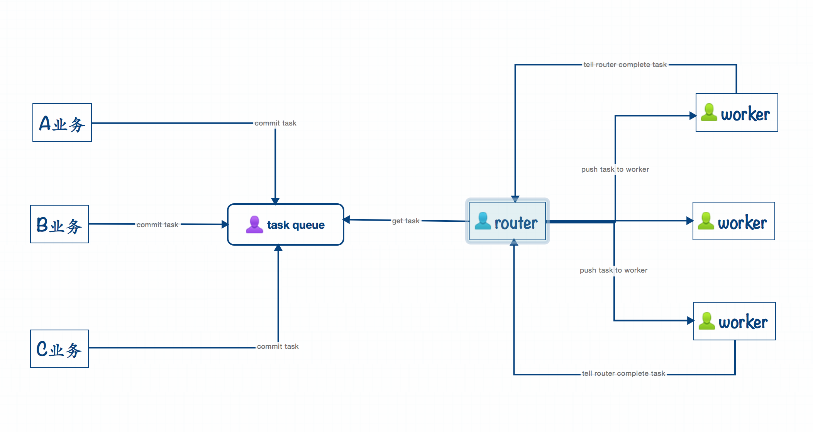

## 概述

适用于java项目中需要异步处理、批量处理、任务调度等业务处理场景 

### 设计模型
* task-queue【任务中心】：任务管理容器，基于redis list数据结构实现的任务队列，目前队列只支持FIFO消费模式 
* router【路由器】：任务分发器,负责调度任务容器中task给worker去执行，并协调系统中router和worker的执行，监控worker的状态，异常情况 
* worker【任务执行者】：实际任务执行者，负责执行router下发的任务，并在任务执行完毕后可以通知router，等待下一次任务的调度 
* taskContainer【任务容器】：我们把这3个角色合起来称之为任务容器，它对我们开发人员是完全透明，在使用时，我们不必关系这些3个角色，只需要把你要做的事情告诉任务容器，任务容器负责整个任务中心的调度，负载，异常处理。 

### 使用

##### 1. 发布jar到你的maven私服，并加入下面依赖

        mvn install 

        <dependency> 
                <groupId>com.peaceful</groupId> 
                <artifactId>taskmanage</artifactId> 
                <version>1.0-SNAPSHOT</version> 
        </dependency>
        
##### 2. 配置

> 在项目的resource目录的根目录下加入配置文件：taskManage.conf，配置内容如下 

         taskManage{ 
         
             # 使用版本号，目前版本只支持1.0 
             version = 1.0 
         
             # 使用服务的项目名，主要用来防止和别的项目在使用redis 队列时有同名冲突 
             projectName:crmWeb 
         
             # 需要用到的队列，实际在redis中创建的队列名是queueName_ProjectName 
             queueList:[default_1,default_2] 
         
             # 从redis队列中消费队列，并将task路由到下面的worker 
             router:2 
         
             # worker根据task对象的信息执行ProcessQueueClass对象对应的方法 
             worker:6 
         
             # 具体业务处理类 
             processQueueClass:"com.peaceful.task.example.ProcessQueue" 
         
         } 

##### 启动

一、 web容器中，容器初始化过程中，运行下面code：

        QueueServiceStart.setSystem(AkkaSystem.system); 
        QueueServiceStart.run(); 

> 如果启动后看到下面这些配置，说明启动成功
 
        INFO ]  {QUEUE.SERVICE:86}-------------queueService load conf------------------------- 
        INFO ]  {QUEUE.SERVICE:87}-projectName:crmWeb 
        INFO ]  {QUEUE.SERVICE:88}-dispatchParallel:2 
        INFO ]  {QUEUE.SERVICE:89}-execParallel:2 
        INFO ]  {QUEUE.SERVICE:90}-maxParallel:12 
        INFO ]  {QUEUE.SERVICE:91}-queueList:[userLevelAnay, userBasicSync, bonusDealQueue, orderDataToEs] 
        INFO ]  {QUEUE.SERVICE:92}-processQueueClass:cn.edaijia.crm.task.ProcessQueue 
        INFO ]  {QUEUE.SERVICE:93}-------------------------------------- 

二、 单独的jar文件：

程序入口：`com.peaceful.task.manage.Main `

##### 添加任务

>如果你想把自己的业务处理放入到任务容器，你需要的做的事情
 
>* No.1 业务处理入口：在上文配置文件指定的ProcessQueueClass位置编写你的业务入口方法，若想给该方法传参，只支持Map型参数。 
>* No.2 提交到任务容器：提交任务只需要一条code，Task task = new Task(queueName,methodName,params);此时task会返回给你一个task.id，你最好把该id用log记录起来，后文会提到 

##### ok，到目前的介绍，你应该可以把程序启动了，处理你的业务了

 

##### 任务调度，负载，与异常处理

1. 调度：
> router会负责监控任务容器中提交的任务，当router发现有新任务时会立马把任务push给worker，worker通过解析Task对象，可以找到对应的ProcessQueueClass中的业务入口方法和需要的参数，然后执行，执行完毕后worker会告知router，任务已完成，等待下次任务的下发 

1. 负载： 

1. 异常处理
> router在这个模型中的扮演角色之一是worker的监控者，如果worker在执行task时发生异常，如果是worker执行时自己本身的异常或本次task本来就存在业务上的异常，task根本不可以执行完毕 

##### 监控

