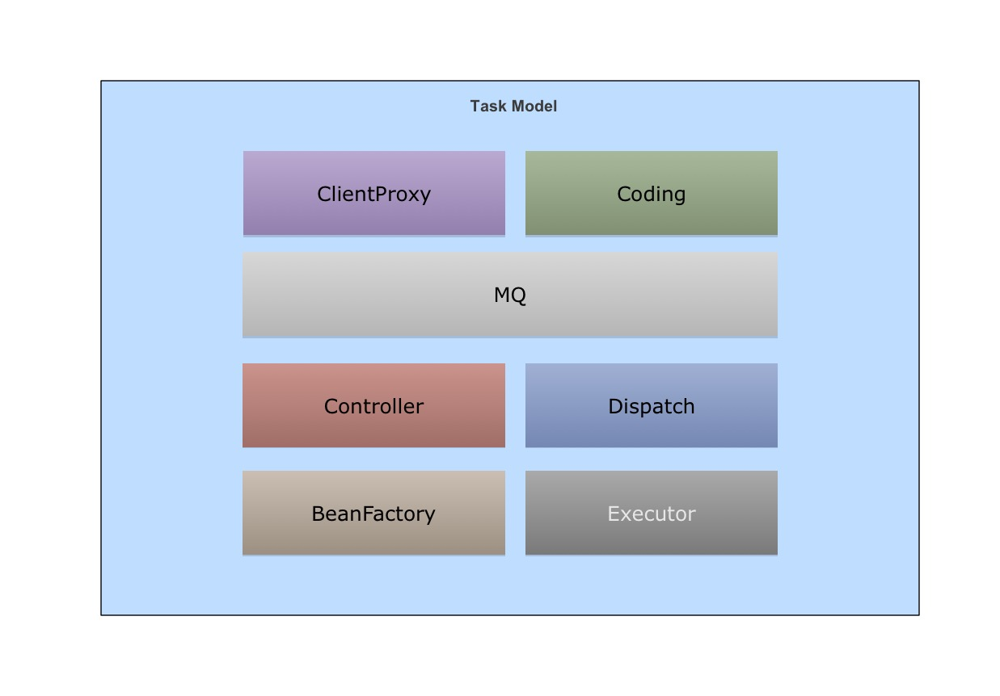

Task系统设计与使用
----------------

Task是一个轻量级的分布式任务计算系统,他可以帮助你快速编写一个可以在集群环境下运行的分布式方法,而这只需要你使用一行代码就可以在你原有的方法上做到.

一个简单例子:

````

public class Hello {

    public void say(String msg) throws InterruptedException {
        Thread.sleep(1000);
        System.out.println(msg);
    }
}


public class SetUp {

    public static void main(String[] args) throws InterruptedException {
        // 获取Hello对象的代理实例
        Hello hello = Task.registerASyncClass(Hello.class);
        // 此时say方法会被立即返回且是被集群中的某个节点给调用了
        hello.say("hello world");
    }
}

````
## Task支持业务场景

Task的设计的目的是支持分布式任务计算,可以作为一款任务执行引擎.支持一下特点:

1. 支持任务的开始\暂停\删除
1. 采用多种调度算法,可以指定任务在特定节点消费\在不同的Executor上执行
1. 扩展性强,可以对接各种mq服务\executor模块\支持Spring的BeanFactory或者第三方DI容器
1. 携带监控系统,可以随时了解系统运行的状态


## Task系统架构
Task主要分为以下几个模块：

</img>

**ClientProxy: **用于获取任务提交的代理对象，如上`Task.registerASyncClass(Hello.class)`可以获取Hello对象的代理实例，用于提交任务到mq服务。

**Coding: **可以对方法的调用动作进行描述和重放方法的执行，并可以对描述信息进行序列化存取到mq服务和反序列化成一个Runnable对象

**MQ： **用于存放方法调用信息描述的地方，默认支持Redis的List结构队列，并预留扩展用于对接各个MQ组件

**Controller: ** 任务调度的控制中心，负责任务调度路由，任务的开始、暂停等动作

**Diapatch: ** Task采用的是拉取的方式进行任务调用。Dispatch模块设计的目的主要是合适的时间去从MQ中拉取任务并监管任务的执行情况，异常处理

**BeanFactory： **任务所属对象的Bean管理，默认采用google的guice管理，已预留扩展，可以方便支持其它DI容器，可以方便扩展Spring的BeanFactory

**Executor: **任务真正执行的地方，Dispatch模块会把拉取到任务通过Coding转成Runnable对象，并交给Executor模块，Executor模块类似于本地的ExecutorService框架，用于本地的并发模型。已预留扩展，可以实现自己的Executor模块


