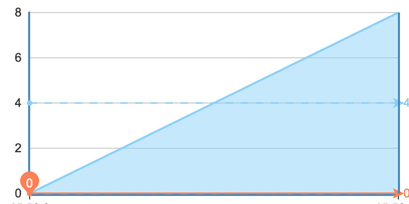

调度策略
-------------

为了更灵活的控制任务调度,Task专门设计了一个无阻塞调度模型,支持以下特点

1. 任务的开始\暂停\结束
2. 优先级配置,为不同优先级的任务分配不同性能的Executor
3. 任务路由控制,可以控制任务在指定的节点运行
4. 设置节点的运行模式,可分为server和client模式,在client模式下只可以提交任务
5. 专门设计的dispatch模块,可以减少因为宕机或特别原因引起的任务丢失
6. 任务监管模式设计,可以在异常时自动尝试或重启


## 节点调度模型

</img>

Task采用主动拉取的方式进行任务分配,每个节点可以根据当前机器的性能去执行任务.在拉取模式中主要分为外部拉取[OutDispatch]和内部拉取[InnerDispatch].
它们主要的区别是:OutDispatch会定时到MQ服务中拉取任务,默认是1s.如果有任务就会交给Executor执行,Executor在执行完后都会通知InnerDispatch,InnerDispatch会
根据收到的通知消息来判断任务的执行情况去决定InnerDispatch是否需要到MQ中拉取任务在派给该Executor.下面是一个正常的任务执行完成后Executor发给InnerDispatch的消息

````
completed Test07-wangjun的MacBook-main-55083111199 on default remote wait 77121982ms local wait 103ms cost 1003ms
````

这条消息的意思是说:Test07-wangjun的MacBook-main-55083111199这条任务在名为default的Executor执行,该任务在从MQ到拉取到该节点前在MQ中存储的时间是77121982ms,
本地等待Executor执行的时间是103ms,任务执行耗时是1003ms

按照上述理论,如果一个Executor支持同时执行8个任务,每个任务用时都是1s,那它达到最大并发的时间是8s,它的消费速率变化应该如下所示

</img>

这样设计的目的:第一规避了节点盲目访问MQ的问题.第二节点可以在合适的时间从MQ拉取,不会照成任务拉取到本地而不能被及时被执行的问题.

## 集群调度控制
集群调度控制是从宏观上进行任务干预，控制集群中每个节点。

### 设置节点模式

节点模式分为server和client模式,在client模式下任务只可以提交不可以消费。server模式是既可以消费也可以生成任务。这样设计的目的是你可以根据机器的用途，单独划分出消费机器。设置模式的方式有两种，第一在启动前设置：

1. 可以通过启动时添加java命令参数： -Dtask.boot.mode=server[client]
2. 也可以在配置文件中指定：boot-mode = "server"["client"]
3. 在运行时也可以切换模式，已在监控部署章节描述

注意：各种方式的区别，在运行前如果指定为client模式，Task将不会启动Dispatch和Executor模块，且设置后不可以在运行期进行模式切换

### 设置任务路由

控制任务在指定的节点消费的功能在实际使用中很有用处。比如你正在预发布环境测试一个功能，在分布式环境下你很难进行回测，但你把任务指定带指定的机器问题就转变的简单了。另外，如果你发现某个任务阻塞到了其它任务调度而系统的调度算法又不可以很好的解决阻塞，我们可以认为干预它的调度，为它单独分配资源，避免阻塞其它资源


