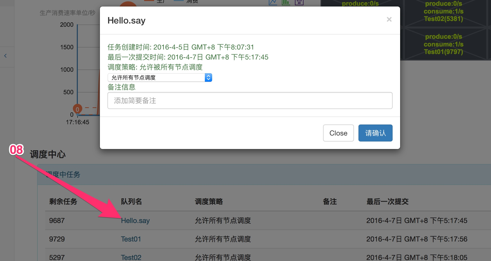

监控部署
-----------
监控项目是独立于Task项目之外,你可以通过监控项目随时了解你的Task系统的运行情况,并可以通过监控进行一些简单的设置

## 部署方式

如果你已经成功启动Task项目并看到了预期的结果,你在去部署监控项目也不迟.你可以通过默认携带的jetty插件启动监控项目,进入到task-ops目录运行以下命令:

    mvn jetty:run

项目启动成功后访问:127.0.0.1:8888,你将看到以下内容

**01 **Task集群列表，其中集群的名字和task.conf配置的name要一致

**02、03 **任务消费和生成的实时速率，左侧图表是整体速率，右侧是每个队列的消费生成速率

**04 **正在调度中的任务列表

**05 **集群列表

**06 **系统启动的Executor列表

**07 **系统已完成调度任务列表

**08 **可以具体查看任务信息并可以配置任务的调度策略

**09 **查看节点信息，并可以配置节点的运行模式

关于调度策略和运行模式会在下文解释

                   
